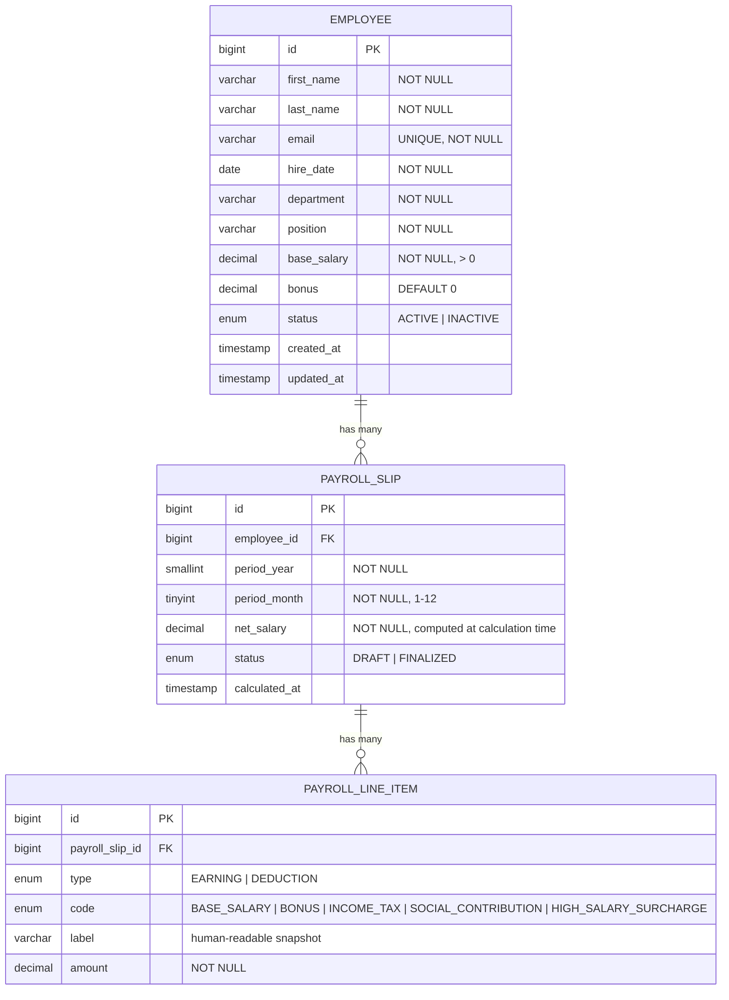

> **Unique constraint:** `PAYROLL_SLIP(employee_id, period_year, period_month)` — enforced at DB level.
>
> **Net salary** is stored as a denormalized column on `PAYROLL_SLIP`, computed once at calculation time (`SUM(EARNING) - SUM(DEDUCTION)`) and never recalculated.
>
> **Immutability:** once `PAYROLL_SLIP.status = FINALIZED`, no modifications allowed — enforced in the service layer.
>
> **Department and Position** are plain `VARCHAR` fields on `EMPLOYEE` — no separate tables or management APIs.
